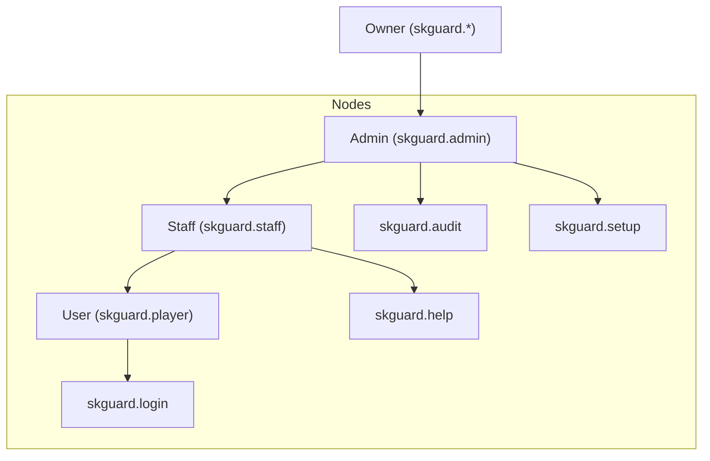

# 🛡️ SKGuard Security - Official Wiki

Welcome to the official documentation for **SKGuard**, the ultimate security suite for Minecraft servers. This wiki provides a deep dive into every feature, command, and configuration option.

---

## 🚀 Quick Start
1. **Installation**: Drop `SKGuard.jar` into your `/plugins` folder.
2. **Setup**: Run `/skguard setup` in-game to select a security preset.
3. **Configure**: Customize your settings in the modular files in `/plugins/SKGuard/`.

---

## 🛠️ Command Reference
SKGuard uses a streamlined command system. Hover over commands in-game for more info.

| Command | Permission | Description |
| :--- | :--- | :--- |
| `/skguard gui` | `skguard.admin` | Open the central security control panel. |
| `/skguard setup` | `skguard.admin` | Launch the guided setup wizard. |
| `/skguard help` | `skguard.help` | View interactive help menu. |
| `/skguard reload` | `skguard.admin` | Reload all configurations and modules. |
| `/skguard panic` | `skguard.panic` | Toggle emergency lockdown mode. |
| `/skguard audit` | `skguard.audit` | Search security logs asynchronously. |

---

## 📦 Module Deep-Dive
SKGuard is built with an ultra-modular architecture. Each module can be toggled independently.

### 🔐 Identity & Access
- **AuthModule**: Handles `/login` and `/register`. Uses Argon2 hashing for maximum security.
- **StaffSecurity**: Adds IP-whitelisting and GUI Pattern PINs for all administrators.
- **IP Drift Lock**: Prevents session hijacking by monitoring IP changes in real-time.

### 🛡️ Defensive Systems
- **AntiExploit**: Blocks malformed packets, crash items, and illegal inventory data.
- **VPNDetector**: Multi-API detection of Proxies, VPNs, and Datacenters.
- **AI Bot Firewall**: Uses heuristic analysis to distinguish bots from human players.

---

## 🔑 Permissions Hierarchy

---

## 📁 Configuration Layout
Since version 2.1+, SKGuard uses a **Modular Config System**:

- `config.yml`: Core settings and global toggles.
- `auth.yml`: All identity and access settings.
- `protection.yml`: Anti-cheat, anti-bot, and exploit settings.
- `database.yml`: Connection strings for MySQL/SQLite/MongoDB.
- `messages.yml`: Full translation and prefix customization.
- `advanced.yml`: Technical performance and threading tweaks.

---

## ❓ FAQ & Troubleshooting
> [!TIP]
> **Issue**: A player is wrongly blocked as a VPN.
> **Fix**: Add their IP to the `whitelist` in `protection.yml` or lower the `risk-threshold`.

> [!IMPORTANT]
> **Performance**: For 200+ players, we recommend switching to **MySQL** and enabling `async-logs` in `advanced.yml`.

---
*Powered by SKGuard Intelligence Engine*
